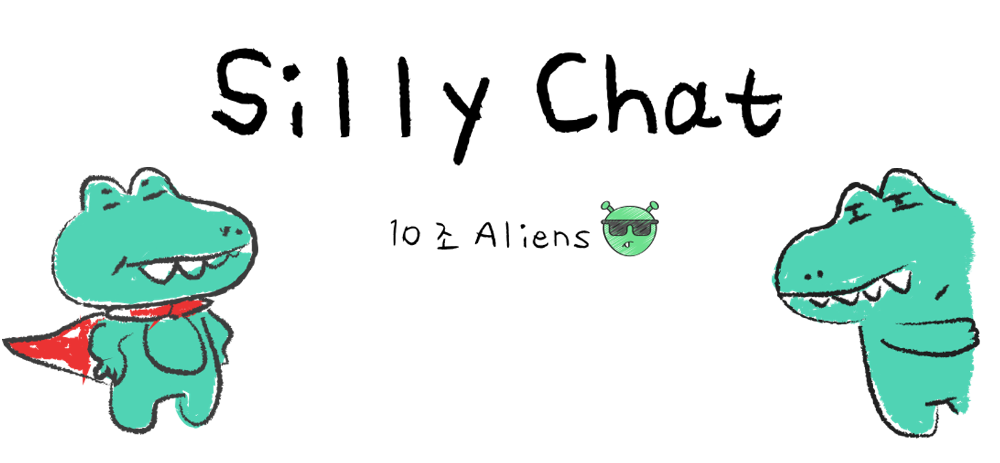
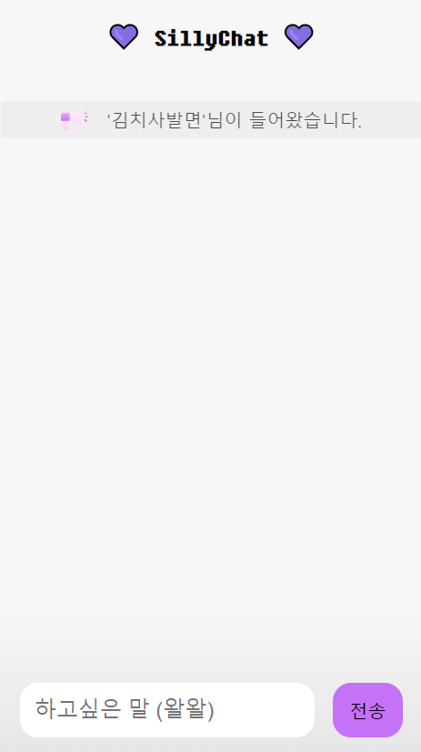
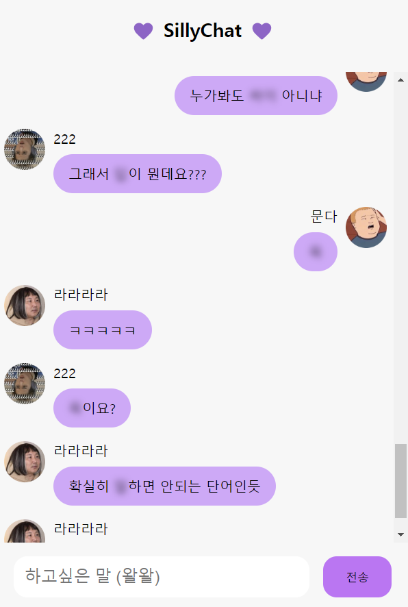
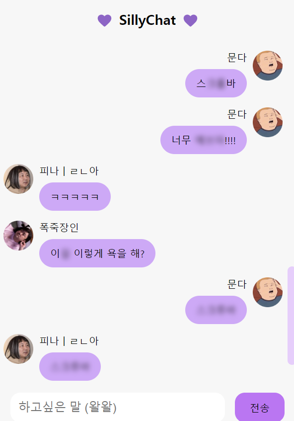
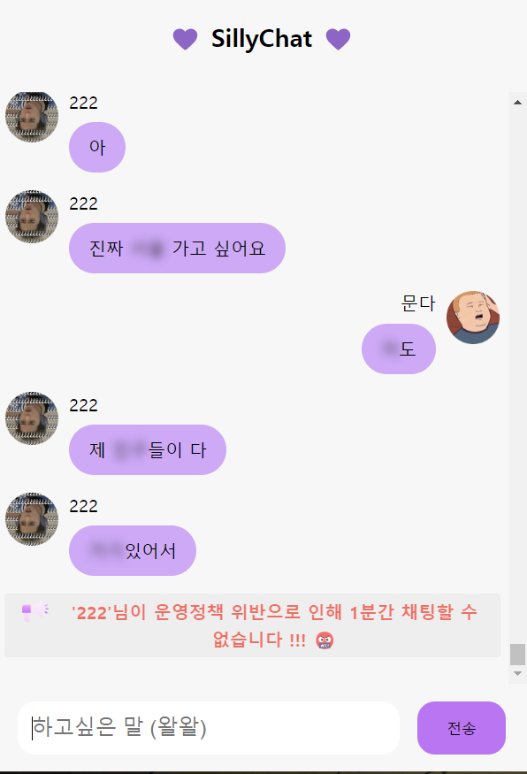
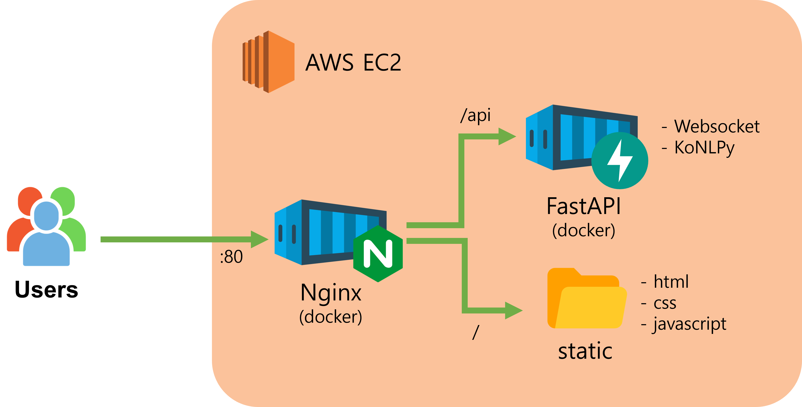

<p align="middle">
  

  <h1 align="middle">SillyChat</h1>
  <p align="middle">바보같지만, 재미있는 채팅!</p>
  <p align="middle">이 프로젝트는 <a href="https://festa.io/events/2825">놀러와요 해커톤</a> 대회에서 🏆1등으로 선정되었습니다. 👏👏👏</p>

</p>

<br><br>

## 프로젝트 소개

채팅을 방해하는 채팅 앱, 상상이 되시나요? 이 앱은 바보같지만 창의적인 방법으로 재미를 줍니다. 소통을 다른 관점에서 본 SillyChat의 매력, 확인해보실까요?

- 채팅 앱이지만, 채팅의 단어 ■■가 무작위로 블러처리 됩니다.
- 가끔씩 랜덤한 이모지가 붙습니다. 🤬
- 정말 낮은 확률로 채팅을 치면 1분간 밴🚫 처리 됩니다.

|  |  |
| :-----------------------: | :-----------------------: |

<br><br>

## 바람직한 사용법

|  |  |  |
| :-------------------------: | :-------------------------: | :-------------------------: |
| 대체 무슨 말들을 하는거야?  |         너 욕했지??         |   서버가 저를 억까해요 😭   |

<br><br>

## 프로젝트 실행

이 프로젝트를 실행하려면 docker 및 docker-compose 가 필요합니다.

1. 프로젝트 빌드

```
$ docker-compose build
```

2. 프로젝트 구동에 필요한 이미지 풀

```
$ docker-compose pull
```

3. 실행

```
$ docker-compose up -d
```

`http://localhost` 주소로 접속할 수 있습니다. (포트: 80)

<br><br>

## 프로젝트 구조



- 프론트엔드는 **html, css, javascript**로 구현하였습니다.
- 백엔드는 **FastAPI**를 사용했습니다.
- 실시간 양방향 데이터 스트리밍을 위해 **WebSocket**을 사용했습니다.
- 한글의 형태소를 분석하고 명사를 블러 처리하기 위해 **KoNLPy** 라이브러리를 사용했습니다.

<br><br>

## 팀원 소개

|                  [solo5star](https://github.com/solo5star)                   |                     [coke98](https://github.com/coke98)                      |                    [moondda](https://github.com/moondda)                     |                   [TrixieL20](https://github.com/TrixieL20)                   |
| :--------------------------------------------------------------------------: | :--------------------------------------------------------------------------: | :--------------------------------------------------------------------------: | :---------------------------------------------------------------------------: |
|  |  |  |  |
|                              백엔드/프론트엔드                               |                                    백엔드                                    |                                  프론트엔드                                  |                                  프론트엔드                                   |
